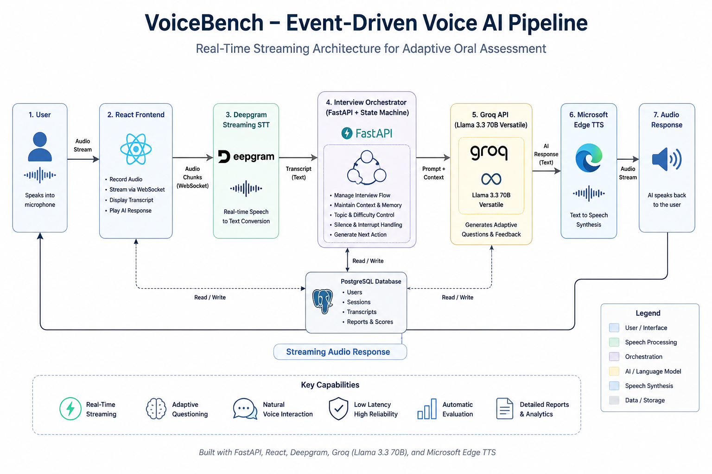

# VoiceBench

## A Low-Latency Event-Driven Voice AI Platform for Adaptive Topic-Focused Oral Assessment

> A research-oriented voice AI platform that simulates real-time oral assessments through natural voice conversations. VoiceBench combines streaming speech recognition, adaptive questioning, conversational memory, and automated evaluation to create a low-latency interview experience across any learning domain—from computer science to science, aptitude, languages, and general knowledge.

VoiceBench is an event-driven voice AI assessment platform designed to bridge the gap between traditional text-based AI systems and real-time spoken interactions. Instead of relying on typed responses, the platform conducts adaptive voice conversations that continuously evaluate a learner's understanding while dynamically adjusting question difficulty.

The system employs a streaming architecture consisting of Speech-to-Text (STT), a conversational orchestration engine, Large Language Models (LLMs), and Text-to-Speech (TTS) synthesis to minimize interaction latency and create a natural interview experience. Every interview session is automatically evaluated, scored, and archived, enabling detailed performance analytics and longitudinal learning assessment.

---

## 🌐 Live Deployment

| Service | URL |
|----------|-----|
| **Frontend** | [https://your-vercel-url.vercel.app](https://voice-bench-frontend-5iqx.vercel.app/) |
| **Backend API** |[ https://your-render-url.onrender.com](https://voice-ai-interview-agent.onrender.com/docs) |

---


---

## Technical Overview

| Category | Specification |
|-----------|---------------|
| Project Type | Event-Driven Voice AI Assessment Platform |
| Primary Language | Python 3.11 |
| Backend Framework | FastAPI |
| Frontend Framework | React |
| Communication Protocol | REST API + WebSockets |
| Speech-to-Text Engine | Deepgram Streaming API |
| Large Language Model | Groq API (Llama 3.3 70B Versatile) |
| Text-to-Speech Engine | Microsoft Edge TTS |
| Voice Processing | Real-Time Streaming Pipeline |
| State Management | Custom Event-Driven Interview State Machine |
| Deployment | Render (Backend) + Vercel (Frontend) |
| Data Storage | PostgreSQL |
| Authentication | JWT Authentication |

---

## 🏗 System Architecture

VoiceBench is built on a **low-latency event-driven architecture** that enables continuous real-time voice interaction. Each component is independently responsible for speech processing, interview orchestration, AI reasoning, and voice synthesis, resulting in a modular and scalable conversational pipeline.

<p align="center">

</p>

<p align="center">
<b>Figure 1.</b> End-to-end event-driven architecture powering real-time adaptive voice conversations.
</p>

---

## ⚙️ Architectural Principles

- ⚡ Event-Driven Processing
- 🎙 Continuous Voice Streaming
- 🧠 Adaptive Interview Orchestration
- 🔄 Modular AI Service Integration
- 📡 Real-Time Response Generation
- 💾 Persistent Conversation History

---

## 🧩 Core Components

| Layer | Responsibility |
|--------|----------------|
| 🎤 Client | Captures user voice and streams audio |
| 🗣 Deepgram STT | Real-time speech recognition |
| ⚙ FastAPI Engine | Interview orchestration & state management |
| 🤖 Groq Llama 3.3 70B | Adaptive question generation |
| 🔊 Microsoft Edge TTS | Natural speech synthesis |
| 🗄 Supabase | Session persistence & interview history |

---

## 🔄 Voice Processing Pipeline

VoiceBench processes every conversation through a streaming voice pipeline that continuously transforms speech into contextual AI interactions while maintaining interview state and minimizing response latency.

<p align="center">

</p>

<p align="center">
<b>Figure 2.</b> End-to-end voice processing pipeline from speech capture to adaptive response generation.
</p>

---

## 🚀 Pipeline Characteristics

- ⚡ Streaming speech recognition
- 🧠 Context-aware AI reasoning
- 🎯 Adaptive follow-up questioning
- ⏱ Automatic silence recovery
- 🔄 Continuous conversational flow
- 🎙 Natural voice playback

---

## Interview State Machine

VoiceBench follows a deterministic event-driven state machine that guarantees synchronized interaction between speech recognition, AI reasoning, and speech synthesis. This architecture prevents race conditions, overlapping audio streams, and inconsistent conversation flow while maintaining a natural interview experience.

<p align="center">

</p>

<p align="center">
<b>Figure 3.</b> Internal finite-state machine governing the VoiceBench interview lifecycle. 
</p>

---

## 🧠 Core Engineering Decisions
The VoiceBench platform is designed around a set of architectural decisions that prioritize **low latency**, **deterministic conversation flow**, and **scalable real-time voice interactions**.

> ### ⚡ Event-Driven Architecture
>
> VoiceBench follows an event-driven architecture where every stage of the conversation—speech recognition, AI reasoning, and speech synthesis—is triggered by independent events. This design minimizes blocking operations and enables responsive, low-latency voice interactions.

---

> ### 🔄 Finite State Machine
>
> A deterministic finite-state machine (FSM) governs the entire interview lifecycle, ensuring synchronized transitions between AI speech, user listening, silence recovery, answer processing, and adaptive question generation. This approach prevents race conditions and guarantees predictable conversational behavior.

---

> ### 📈 Adaptive Difficulty Engine
>
> Rather than following a fixed interview script, VoiceBench dynamically adjusts question complexity based on user performance. This creates personalized learning sessions while maintaining conversational continuity throughout the assessment.

---

> ### 🎙 Streaming Voice Processing
>
> Speech is processed incrementally using real-time streaming transcription instead of waiting for complete recordings. Continuous audio processing significantly reduces perceived latency and enables natural conversational interactions.

---

> ### 🔊 Shared Audio Controller
>
> A centralized audio controller manages every playback event within the application. This prevents overlapping speech, synchronizes AI responses with user interactions, and delivers a seamless interview experience.

---

> ### 🛡 Robust Silence Recovery
>
> Intelligent silence detection continuously monitors user activity and automatically issues warnings, repeats questions when necessary, and gracefully recovers stalled conversations without interrupting the overall interview flow.

---

## 📂 Repository Architecture

VoiceBench adopts a modular architecture that separates authentication, interview orchestration, AI reasoning, speech processing, and persistence into independent layers.

```text
VoiceBench
│
├── backend
│   ├── core          # Configuration & security
│   ├── db            # Database & ORM models
│   ├── routers       # REST API endpoints
│   ├── schemas       # Data validation models
│   ├── services      # AI, interview & speech logic
│   └── images
│
├── frontend
│   ├── components
│   ├── pages
│   ├── hooks
│   ├── context
│   ├── api
│   ├── utils
│   └── assets
│
├── README.md
└── requirements.txt
```

---

## ⚙️ Technology Stack

| Layer | Technology | Purpose |
|-------|------------|---------|
| **Frontend** | React + Vite | Interactive user interface |
| **Animation** | Framer Motion | Smooth UI transitions |
| **Backend** | FastAPI | High-performance asynchronous API |
| **Speech Recognition** | Deepgram Streaming STT | Real-time speech transcription |
| **Large Language Model** | Groq API (Llama 3 70B Versatile) | Adaptive interview reasoning |
| **Speech Synthesis** | Microsoft Edge TTS | Natural AI voice generation |
| **Authentication** | JWT | Secure user sessions |
| **Database** | PostgreSQL | Interview history & reports |
| **Deployment** | Render + Vercel | Backend and frontend hosting |
| **Version Control** | Git & GitHub | Collaborative software development |

---

## 📈 Adaptive Difficulty Algorithm

VoiceBench dynamically adjusts interview complexity based on the candidate's previous responses. Instead of using a fixed question list, the system continuously evaluates answer quality and selects the next question to maintain an appropriate learning challenge.

### Decision Logic
| Performance                | Next Difficulty     |
| -------------------------- | ------------------- |
| Strong Answer              | Increase Difficulty |
| Average Answer             | Maintain Difficulty |
| Weak Answer                | Reduce Difficulty   |
| Consecutive Weak Responses | Recovery Questions  |

<p align="center">

</p>

<p align="center">
<b>Figure 3.</b> Internal finite-state machine governing the VoiceBench interview lifecycle. 
</p>

---

## ⚙️ Engineering Challenges

Building a real-time conversational system required solving multiple synchronization and latency challenges beyond traditional web applications.

| Challenge                    | Solution                                  |
| ---------------------------- | ----------------------------------------- |
| Speech recognition lifecycle | Event-driven microphone management        |
| Audio playback conflicts     | Shared audio controller                   |
| Silence timeout detection    | Adaptive silence state machine            |
| Speech synchronization       | Coordinated TTS/STT transitions           |
| Conversation continuity      | Session-based interview orchestration     |
| Race conditions              | Controlled asynchronous state transitions |

---

## ⚡ Performance Considerations

VoiceBench is designed around low-latency conversational interaction rather than batch processing. The architecture prioritizes continuous streaming, responsive feedback, and efficient event synchronization to maintain natural voice conversations.

### Optimization Goals

| Objective                  | Approach                         |
| -------------------------- | -------------------------------- |
| Low conversational latency | Streaming speech processing      |
| Responsive user experience | Event-driven state transitions   |
| Smooth voice interaction   | Continuous TTS/STT coordination  |
| Stable session management  | Stateful interview orchestration |
| Scalable backend           | Asynchronous FastAPI services    |

---

## 📦 Installation & Local Deployment

### Prerequisites

- Python **3.11+**
- Node.js **18+**
- npm
- Git

---

### Clone Repository

```bash
git clone https://github.com/<your-username>/VoiceBench.git
cd VoiceBench
```

---

### Backend Setup

```bash
cd backend

python -m venv venv

## Windows
venv\Scripts\activate

## Linux/macOS
source venv/bin/activate

pip install -r requirements.txt
```

---

### Frontend Setup

```bash
cd frontend

npm install
```

---

### Configure Environment

Create a `.env` file inside the backend directory.

```env
GROQ_API_KEY=your_groq_api_key
DEEPGRAM_API_KEY=your_deepgram_api_key
JWT_SECRET_KEY=your_secret_key
DATABASE_URL=your_database_url
```

---

### Run Application

Backend

```bash
uvicorn app.main:app --reload
```

Frontend

```bash
npm run dev
```

| Component | URL |
|------------|------------------------|
| Frontend | http://localhost:5173 |
| Backend | http://localhost:8000 |

---

## 🔌 API Reference

VoiceBench exposes a lightweight REST API for authentication, interview orchestration, speech processing, and evaluation.

| Method | Endpoint | Description |
|---------|----------|-------------|
| POST | `/auth/register` | Register user |
| POST | `/auth/login` | User authentication |
| POST | `/interview/start` | Start interview session |
| POST | `/interview/question` | Generate next question |
| POST | `/speech/stt` | Speech-to-Text |
| POST | `/speech/tts` | Text-to-Speech |
| POST | `/interview/evaluate` | Evaluate response |
| GET | `/history` | Interview history |
| GET | `/report/{id}` | Interview report |

---

### Authentication

```http
Authorization: Bearer <JWT_TOKEN>
```

---

### Sample Response

```json
{
  "score": 8.7,
  "difficulty": "Medium",
  "next_question": "...",
  "feedback": "..."
}
```

All endpoints communicate using **JSON** and are secured using **JWT-based authentication**.

---

## Conclusion

VoiceBench demonstrates how modern conversational AI systems can be engineered using an event-driven architecture to deliver responsive, low-latency voice interactions.

By integrating speech recognition, adaptive reasoning, real-time evaluation, and speech synthesis into a unified pipeline, the project explores practical approaches for building scalable AI-powered educational platforms.

This repository reflects an end-to-end implementation of modern AI application engineering—from backend architecture and frontend interaction design to asynchronous voice processing and adaptive conversation management.

---

**Developed by Geethika Tammineni**

Aspiring Software Engineer | Backend Development | AI Systems

If you found this project interesting, feel free to connect, contribute, or share feedback.
